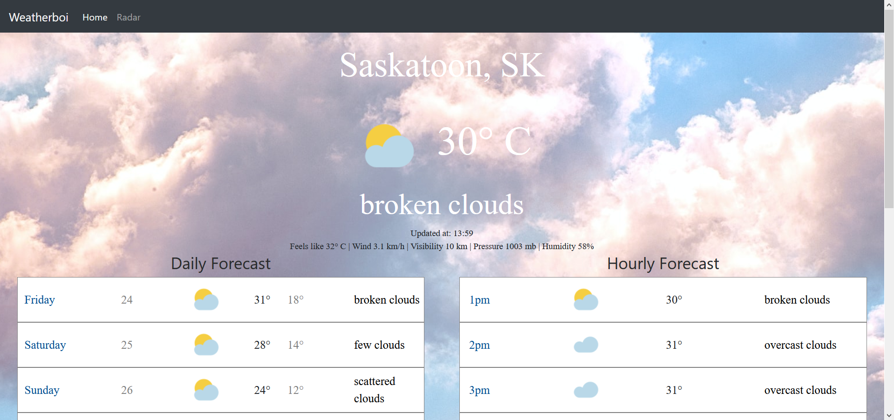

## Table of contents
* [General info](#general-info)
* [Technologies](#technologies)
* [Setup](#setup)
* [Sample Images](#sample images)

## General info
This project is a simple weather application. Includes current conditions, hourly and 5 day forecast, and radar.
	
## Technologies
Project is created with:
* React 16.13.1
* React-Bootstrap 1.2.2
* Google-Maps-React 2.0.6
	
## Setup
To run this project, install it locally using npm:

```
$ cd ../lorem
$ npm install
$ npm start
```

Open [http://localhost:3000](http://localhost:3000) to view it in the browser.

## Sample Images




